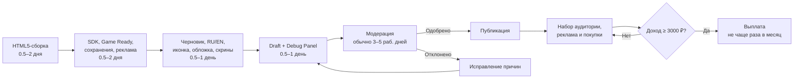

# Яндекс Игры в 2026 году: как опубликовать HTML5‑игру, пройти модерацию и начать зарабатывать

## Исполнительная сводка

**Да — свою браузерную игру в Яндекс Игры реально загрузить самостоятельно и получать с неё деньги.** На 10 августа 2026 года Яндекс прямо называет Яндекс Игры бесплатной платформой для публикации браузерных игр: разработчик загружает HTML5-сборку, подключает SDK, проходит модерацию, после чего может зарабатывать на рекламе и внутриигровых покупках. citeturn17search1turn26view1

> «Яндекс Игры — бесплатная платформа для публикации браузерных игр». citeturn17search1

При этом это **не модель “сделал игру — сразу получил оплату”**. Деньги начисляются из фактического дохода игры; выплаты происходят не чаще раза в месяц, минимальный порог сейчас составляет **3 000 ₽**, а при достижении порога выплата производится в течение 20 рабочих дней следующего месяца. citeturn19search1turn22view1

> «Минимальная сумма: 3000 рублей». citeturn19search1

Для разработчика из РФ вывод денег практически реализуем: действующее лицензионное соглашение предусматривает способ выплаты, выбранный в партнёрском интерфейсе, а при наличии технической возможности отдельно перечисляет **Систему быстрых платежей (СБП)** и электронные кошельки; при невозможности альтернативной выплаты Яндекс может заплатить по банковским реквизитам. Это означает, что российский банковский счёт/карта, привязанные к СБП, подходят как конечное место получения денег, если СБП доступна вам в интерфейсе. **Перевод непосредственно по 16-значному номеру карты соглашением не гарантируется.** citeturn22view1

С технической точки зрения входной порог довольно низкий. Основной вариант — **ZIP с HTML5/WebGL-игрой**, в корне которого находится `index.html`; распакованный архив должен весить не более 100 МБ. SDK Яндекс Игр обязателен. Официальные плагины есть для Unity, Cocos Creator, Construct 3, Defold и TypeScript, но Яндекс отдельно указывает, что SDK может использоваться с любым движком, способным взаимодействовать с JavaScript и поддерживающим HTML5. citeturn19search2turn19search3

Самая важная новая деталь для вашего направления с ИИ: в актуальных требованиях от **1 июля 2026 года** появился отдельный пункт 1.23. **Интерактивный ИИ внутри игры запрещён, но заранее сгенерированные ИИ-материалы разрешены.** То есть генерировать персонажей, фоны, предметы, текстуры и другую графику нейросетью и затем включать их в сборку можно; делать внутри игры чат/генератор, который генерирует контент пользователю в реальном времени, по текущему правилу нельзя. При этом вы всё равно гарантируете Яндексу наличие необходимых прав на материалы. citeturn24search0turn21view0

**Моя итоговая оценка:**

| Вопрос | Вывод |
|---|---|
| Можно ли одному человеку опубликовать игру? | **Да.** Не требуется издатель или компания. citeturn17search0turn21view0 |
| Публикация платная? | **Нет, платформа заявлена как бесплатная.** citeturn17search1 |
| Нужен ли Unity? | **Нет.** Подойдёт практически любой HTML5/JS-совместимый движок. citeturn19search2 |
| Можно vanilla HTML/CSS/JS? | **Да**, при выполнении требований SDK и платформы. Это следует из поддержки любого HTML5/JavaScript-совместимого решения. citeturn19search2 |
| Можно WebGL? | **Да.** Яндекс прямо подтверждает поддержку WebGL. citeturn18view0 |
| Можно AI-графику? | **Да, заранее сгенерированную.** Интерактивный ИИ запрещён. citeturn24search0 |
| Можно игру, уже опубликованную в другом месте? | **Да.** citeturn18view0 |
| Можно клонировать популярную игру? | **Нет.** Полные и частичные копии запрещены. citeturn24search0turn21view0 |
| Сколько модерация? | Обычно **3–5 рабочих дней**. citeturn18view0turn24search0 |
| Деньги приходят сразу после показа рекламы? | **Нет.** Расчётный период — месяц. citeturn19search1turn22view1 |
| Минимальная выплата | **3 000 ₽**. citeturn19search1turn22view1 |
| Вывод в РФ | **Да:** способы интерфейса, СБП при технической доступности либо банковские реквизиты. citeturn22view1 |
| Насколько легко заработать? | Опубликоваться заметно проще, чем гарантированно заработать. Доход зависит от рейтинга, ежедневной аудитории, времени игры и возвращаемости. citeturn26view1 |

## Технические, контентные и юридические требования

### Формат игры и движок

Стандартный путь публикации выглядит так: вы экспортируете игру как браузерную HTML5/WebGL-сборку, помещаете её в ZIP и загружаете через Консоль разработчика. В корне архива должен находиться **один `index.html`**, размер всех файлов в распакованном виде — максимум **100 МБ**; в названиях файлов и директорий нельзя использовать пробелы и кириллицу. citeturn19search3turn24search0

Официальные интеграции Яндекса существуют для:

**Unity → WebGL**, **Cocos Creator**, **Construct 3**, **Defold**, **TypeScript**. Кроме них можно использовать Phaser, PixiJS, Three.js, Godot с подходящим HTML5-экспортом, собственный JS-код и другие решения: официальная документация формулирует правило шире — методы SDK едины для движков, которые могут обращаться к JavaScript и поддерживают HTML5. citeturn19search2

Для простой игры я бы практически предпочёл **Phaser/vanilla JavaScript** либо Construct 3, если важна скорость разработки. Unity оправдан, если уже есть опыт с ним или требуется полноценная 3D/WebGL-сцена. Это рекомендация, а не требование Яндекса.

### SDK, сохранения и жизненный цикл

SDK обязателен даже для игры без рекламы. Требуется корректная инициализация SDK и вызов `LoadingAPI.ready()` именно тогда, когда пользователь фактически уже может начинать играть. Ошибочная интеграция SDK и Game Ready входит в официальный список частых причин отказа. citeturn18view0turn26view1

Если в игре есть прогресс — уровни, рекорды, достижения, улучшения — изменения должны сохраняться непосредственно после значимого действия либо по явной кнопке сохранения; перезагрузка страницы не должна обнулять результат. Для облачных данных Яндекс предоставляет объект `Player`; данные можно хранить на серверах Яндекса либо на своём сервере. citeturn24search0turn17search7

Обязателен гостевой режим. Нельзя требовать регистрацию во внешнем сервисе; авторизация допускается через Яндекс ID и должна инициироваться осознанным действием пользователя, причём отказавшийся авторизоваться игрок всё равно должен иметь возможность играть. citeturn17search8

### Внешние серверы, ассеты и кроссдоменные запросы

Самый беспроблемный вариант — положить игровые ассеты непосредственно в ZIP и позволить Яндексу хостить игру. Яндекс прямо рекомендует хранить каталоговую игру на своих серверах. citeturn19search3

Если нужны API, серверная логика, DLC или динамически подгружаемые ресурсы, внешний домен разрешён, но его необходимо добавить в разделе **Настройки → разрешённые хосты** и объяснить модерации причину. Ограничения довольно конкретны:

| Параметр | Правило |
|---|---|
| Адрес | Только имя хоста, без `/path`. citeturn18view0 |
| IP | IP-адрес вместо домена не допускается. citeturn18view0 |
| Порт | Явный порт в записи хоста не допускается. citeturn18view0 |
| Протокол | Используются `https` и `wss`; `http` и `ws` не допускаются. citeturn18view0 |
| CSP | Игра должна удовлетворять Content Security Policy Яндекса. citeturn18view0 |
| Объём | Хост не согласуют, если через него фактически загружается почти вся игра. citeturn18view0 |
| Ошибки сети | Игра должна нормально сообщать о проблеме соединения и давать пользователю понятное действие: повторить запрос, перезагрузить и т. п. citeturn18view0 |

Если архитектура действительно требует размещать практически всю игру на вашем сервере, можно запросить `iframe`-интеграцию у поддержки. Нужно предоставить HTTPS-ссылку и объяснить, почему обычная загрузка архива не подходит; Яндекс приводит multiplayer со сложной серверной архитектурой как типичный пример. citeturn19search3turn18view0

### Устройства и интерфейс

Для mobile игра во время запуска/геймплея должна работать полноэкранно, полностью управляться жестами, не вызывать системное контекстное меню по долгому нажатию и корректно реагировать на выбранную ориентацию. На desktop должны нормально работать клавиатура/мышь, игровое поле должно адаптироваться к окну без системного скроллбара, а правый клик внутри игры не должен открывать браузерное контекстное меню. citeturn24search0

При переключении вкладки **звук обязан останавливаться**. Во время полноэкранной рекламы должны ставиться на паузу и звук, и игровой процесс. Именно ошибки с аудио входят в официальный перечень частых причин отклонения. citeturn18view0turn24search0

### Минимальная глубина игры

Яндекс больше не принимает совсем примитивный “технический демо-проект” просто потому, что он запускается. Игра должна выглядеть законченной, иметь нарастающую сложность и содержать достаточно контента: прохождение основного содержания должно занимать **более 10 минут**. Для викторин Яндекс отдельно требует не менее **100 недублирующихся вопросов**. citeturn24search0

Кроме того, есть весьма важное пострелизное правило: рейтинг опубликованной игры должен быть выше 30; если в течение трёх недель рейтинг держится на уровне 30 и ниже либо отсутствует, игра может быть снята с публикации. Для новых игр период первоначального формирования рейтинга — примерно две недели — не учитывается. citeturn24search0

Это означает, что стратегия “за один вечер сделать 20 почти пустых игр и оставить их висеть” сейчас стала существенно менее жизнеспособной.

### Контент, возраст и запрещённые темы

Вы выбираете один из рейтингов **0+, 6+, 12+, 16+, 18+**. Чем выше рейтинг, тем больше допускается реалистичного насилия, сексуализированной подачи, алкоголя/табака и грубой лексики. Например, для 0+ нельзя показывать причинение вреда персонажам, пугающие сцены, алкоголь и табак; для 12+ допускается стилизованное нереалистичное насилие без реалистичных ран и крови; для 16+ допускаются реалистичные сцены насилия без крайней натуралистичности. citeturn26view0

Однако здесь обнаруживается **важная несогласованность между двумя официальными страницами Яндекса**. Страница возрастных рейтингов для категории 18+ перечисляет в числе допустимого казино, покер и эзотерику, тогда как общая страница требований, актуализированная 1 июля 2026 года, прямо запрещает эзотерику/гадания и требует, чтобы игра не была азартной игрой или онлайн-лотереей. citeturn26view0turn24search0

Для реальной публикации я рекомендую считать **общие запреты из актуальной страницы “Требования к игре” более безопасной границей**: не делать гадания, казино/лотерею с реальными ценностями и не строить проект вокруг спорного прочтения возрастной таблицы. Это консервативная интерпретация противоречащих друг другу официальных материалов, а не отдельное подтверждение Яндекса. citeturn24search0turn26view0

Также общие требования прямо запрещают или ограничивают материалы, связанные с политикой, политическими деятелями, войнами и внутригосударственными/межгосударственными конфликтами, религией и религиозными атрибутами, предсказаниями жизни, здоровья или смерти, реалистичным насилием над детьми или животными. citeturn24search0

### Уникальность, авторские права и AI-контент

Игра не должна быть полной или частичной копией проекта из каталога, включая другую игру того же разработчика. Продолжение принимается как отдельная игра только при существенной переработке сеттинга и/или механики; иначе новый контент следует добавлять как обновление существующей игры. Даже совпадающее название может привести к классификации как дубликата — название должно быть уникальным в каталоге. citeturn24search0turn19search3

В лицензионном соглашении вы гарантируете Яндексу, что обладаете необходимыми правами на игру, исходный код, графику, музыку и остальные материалы и что использование игры Яндексом не нарушает прав третьих лиц. citeturn21view0

Поэтому при нейрогенерации разумный безопасный вариант — генерировать **собственных персонажей и окружение**, не использовать узнаваемых персонажей Marvel/Disney/Nintendo и т. п., товарные знаки, фотографии знаменитостей и ассеты сомнительного происхождения. Сам факт генерации через ИИ не снимает с разработчика договорной обязанности иметь необходимые права. citeturn21view0turn24search0

И отдельно, по состоянию на июль 2026 года:

**разрешено:** заранее сгенерировать AI-картинку → добавить PNG/WebP в игру → опубликовать;  
**запрещено:** дать игроку поле “напиши запрос” → внутри опубликованной игры отправлять prompt модели → генерировать ему новый интерактивный AI-контент. citeturn24search0

## Пошаговая инструкция по публикации

### Подготовьте игру

Сначала доведите проект до завершённого состояния и экспортируйте браузерную сборку. Для первого релиза рационально сделать игру, которая полностью работает без внешнего backend: это уменьшает количество сетевых причин для отказа и избавляет от согласования дополнительных хостов. Такой подход является практической рекомендацией; Яндекс допускает как полностью архивные игры, так и серверную часть. citeturn18view0

Минимальная структура может выглядеть так:

```text
my-game.zip
├── index.html
├── game.js
├── style.css
├── assets/
│   ├── sprites/
│   ├── sounds/
│   └── fonts/
└── libs/
```

Архив до сжатия должен занимать не более 100 МБ, `index.html` — лежать непосредственно в корне; имена файлов и папок лучше делать латиницей без пробелов. citeturn19search3turn24search0

### Встройте SDK Яндекс Игр

SDK необходимо инициализировать независимо от того, используете ли вы рекламу. Он нужен в том числе для Game Ready, определения языка, рекламы, покупок, Player/облачных сохранений и других возможностей платформы. citeturn19search2turn26view1

Обязательный минимум перед релизом:

`YaGames.init()` работает без ошибки; язык берётся через `ysdk.environment.i18n.lang`; когда загрузка действительно завершена, вызывается `LoadingAPI.ready()`; при потере фокуса ставится на паузу звук; если есть прогресс, он сохраняется; реклама при её наличии вызывается только через SDK. Эти требования непосредственно проверяются модерацией. citeturn18view0turn24search0

### Создайте аккаунт разработчика

Нужен полноценный **Яндекс ID с логином Яндекса**. Яндекс предупреждает, что использование аккаунтов, зарегистрированных только через чужую почту вроде Gmail или Mail.ru, может помешать подключению рекламной монетизации. На один Яндекс ID можно создать один аккаунт разработчика. citeturn17search0

Далее откройте Консоль Яндекс Игр, придумайте имя разработчика, примите лицензионное соглашение и условия платформы и заполните контактные данные. Для разработчика-резидента РФ действующее лицензионное соглашение допускает физическое лицо, ИП и юридическое лицо. citeturn17search0turn21view0

Для коммерческого запуска также понадобятся актуальные платёжные/налоговые реквизиты. Яндекс прямо обязывает разработчика предоставлять действительные платёжные данные для выплаты лицензионного вознаграждения. citeturn21view0

### Создайте отдельный черновик

В Консоли нажмите **«Добавить игру»**. Для каждой самостоятельной игры Яндекс требует новый черновик с уникальным ID; нельзя взять ID уже опубликованной совершенно другой игры и заменить её новым проектом. citeturn18view0turn24search0

Загрузите ZIP и выберите поддерживаемые платформы:

- Desktop;
- Mobile → Android;
- Mobile → iOS;
- TV.

Для iOS требуется Apple Team ID. Указывать стоит только те платформы, на которых игра действительно нормально адаптирована, поскольку модерация будет проверять соответствие заявленным устройствам. citeturn19search3turn24search0

### Настройте локализацию и метаданные

Яндекс рекомендует **русский и английский**, причём наличие английских метаданных увеличивает потенциальную видимость игры за пределами русскоязычной аудитории. Все заявленные языки модерация может проверить непосредственно внутри игры, а автоопределение языка через SDK является обязательным. citeturn19search3turn24search0

Поля карточки сейчас имеют следующие ограничения:

| Поле | Требование |
|---|---|
| Название | До **50 символов**, уникальное в каталоге. citeturn19search3 |
| SEO-описание | **50–160 символов**. citeturn19search3 |
| «Об игре» | **100–1000 символов**. citeturn19search3 |
| Короткое описание | До **70 символов**. citeturn19search3 |
| «Как играть» | **100–1000 символов**. citeturn19search3 |
| Категории | Не более **двух**. citeturn19search3 |
| Теги | До **20**. citeturn19search3 |
| Ключевые слова | До **100 символов**, строчными, через запятую. citeturn19search3 |
| Возраст | Один соответствующий контенту рейтинг. citeturn26view0 |

Не набивайте название и описание поисковым спамом: тексты должны соответствовать фактической механике, а теги и ключевые слова — содержанию. citeturn24search0

### Подготовьте иконку, обложку и скриншоты

На август 2026 года обязательные основные параметры следующие. citeturn19search3

| Материал | Спецификация |
|---|---|
| Иконка | **512×512 PNG**. citeturn19search3 |
| Основная обложка | **800×470 PNG**. citeturn19search3 |
| Обложка витрины | **1560×520 PNG/JPG**, не основной обязательный ассет для базовой карточки. citeturn19search3 |
| Desktop-скриншоты | 16:9, длинная сторона **1280–2560 px**. citeturn19search3 |
| Mobile-скриншоты | 16:9 или 9:16 соответственно ориентации, **1280–2560 px** по длинной стороне. citeturn19search3 |
| Формат скриншотов | JPEG или 24-bit PNG. citeturn19search3 |
| Количество | Минимум **два на каждую выбранную платформу**. citeturn19search3 |

Видео **не обязательно** для обычной публикации. Если всё-таки использовать gameplay-video, официальный предел для соответствующего промоматериала составляет до 28 секунд и 100 МБ; поэтому для вашего сценария “без генерации видео” можно совершенно спокойно ограничиться качественными иконкой, обложкой и скриншотами. citeturn19search3

Скриншоты должны отображать реальный игровой процесс минимум на 70% изображения; нельзя брать gameplay другой игры. Иконку или обложку, в свою очередь, нельзя делать обычным скриншотом геймплея. citeturn24search0

### Настройте внешние домены и страны

Если игра обращается только к файлам внутри ZIP и SDK Яндекса, этот этап максимально простой. При наличии собственного API внесите хосты в настройки и отправьте их на согласование. По умолчанию игра показывается пользователям во всех доступных странах; географию можно ограничить в разделе «Страны и регионы». citeturn18view0

### Протестируйте черновик

Перед модерацией запускайте именно **draft-версию в окружении Яндекса**, а не только локальный `localhost`. Официальное тестирование позволяет проверить SDK, авторизацию, сохранения, рекламу и другие интеграции в окружении, приближенном к релизному. citeturn26view3turn12search0

Используйте Debug Panel — Яндекс позволяет через неё проверять инициализацию SDK, Game Ready, фокус страницы, плохое соединение и другие события; режим можно включать через Консоль или параметр `debug-mode=16`. citeturn12search7

Практически я бы отдельно прошёл игру в Chrome/Яндекс Браузере и на реальном Android-смартфоне, изменил размер окна, несколько раз свернул вкладку, перезагрузил страницу после прогресса и вызвал каждый тип рекламы. Это уже мой тестовый сценарий, основанный на тех категориях ошибок, которые Яндекс официально проверяет. citeturn18view0turn24search0

### Отправьте на модерацию

После теста нажмите **«Отправить на модерацию»**. Одновременно может идти только одна проверка черновика/A-B-теста игры. Яндекс заявляет стандартный срок **3–5 рабочих дней**. citeturn18view0

> «Обычно модерация занимает 3−5 рабочих дней». citeturn18view0

После одобрения игра либо публикуется автоматически, либо получает статус «Проверен», если вы заранее включили отсроченную публикацию. При отказе в Консоли и на почту приходит причина; после исправления игру можно отправлять повторно. citeturn18view0

Любое существенное обновление опубликованной игры также снова проходит модерацию; до утверждения обновления старая версия остаётся опубликованной. citeturn12search4

### Примерный таймлайн

Для **уже готовой небольшой HTML5-игры** практический процесс выглядит так; сроки подготовки до отправки — моя оценка, а 3–5 рабочих дней модерации и схема выплат — официальные правила Яндекса. citeturn18view0turn19search1



Таким образом, **технически вывести готовую игру в каталог примерно за неделю реально**, если она проходит проверку с первого раза. Но момент первой выплаты определяется не датой публикации, а тем, когда игра фактически заработает минимум 3 000 ₽ и закончится соответствующий отчётный период. citeturn18view0turn19search1

## Модерация: полный практический чек-лист и причины отказов

Ниже — чек-лист, который я бы буквально проходил перед каждым релизом. Он построен на действующих требованиях Яндекса и официальном списке наиболее частых отказов. citeturn18view0turn24search0

| Проверка перед отправкой | Что должно быть | Статус |
|---|---|---|
| SDK | Инициализируется без ошибок | ☐ |
| Game Ready | `LoadingAPI.ready()` вызывается после фактической загрузки | ☐ |
| Архив | ZIP, ≤100 МБ распакованным | ☐ |
| `index.html` | Один файл в корне | ☐ |
| Имена файлов | Нет пробелов и кириллицы | ☐ |
| Первый запуск | Игра реально доходит до gameplay | ☐ |
| JavaScript | Нет ошибок, ломающих игру | ☐ |
| Зависания | Нет заметных фризов/вылетов | ☐ |
| Потеря фокуса | Звук останавливается | ☐ |
| Fullscreen ad | Gameplay и звук поставлены на паузу | ☐ |
| Правый клик | Нет системного context menu в игровой области | ☐ |
| Long tap | Нет выделения/контекстного меню на mobile | ☐ |
| Mobile | Управление полностью доступно жестами | ☐ |
| Desktop | Всё работает мышью/клавиатурой | ☐ |
| Размер окна | Ничего не обрезается и не деформируется | ☐ |
| Scroll | Нет системного scrollbar/swipe-to-refresh поверх игры | ☐ |
| Прогресс | Сохраняется после reload | ☐ |
| Язык | Используется `ysdk.environment.i18n.lang` | ☐ |
| Локализации | Все заявленные языки реально присутствуют | ☐ |
| Гость | В игру можно играть без обязательной сторонней регистрации | ☐ |
| Контент | >10 минут основного gameplay | ☐ |
| Возраст | Рейтинг соответствует содержимому | ☐ |
| Уникальность | Нет клона опубликованной игры | ☐ |
| Права | Все изображения/звуки/код имеют допустимое происхождение | ☐ |
| AI | Только заранее сгенерированный AI-контент, не interactive AI | ☐ |
| External hosts | Все необходимые HTTPS/WSS-хосты согласованы | ☐ |
| Реклама | Вызывается только через Yandex SDK | ☐ |
| Rewarded | Игрок сознательно выбирает просмотр и понимает награду | ☐ |
| Скриншоты | ≥2 на каждую заявленную платформу | ☐ |
| Скриншоты | ≥70% изображения — реальный gameplay | ☐ |
| Иконка | 512×512 PNG, не простой screenshot | ☐ |
| Обложка | 800×470 PNG, не простой screenshot | ☐ |
| Тексты | Грамотно написаны и соответствуют реальной игре | ☐ |
| Категория | Соответствует фактическому жанру | ☐ |

Все технические пункты таблицы опираются на требования к SDK, архиву, интерфейсу, сохранениям, языку и рекламе; требования к визуальным материалам и контенту также непосредственно закреплены Яндексом. citeturn19search3turn24search0

### Самые частые ошибки и как их исправлять

**Открывается стандартное меню браузера по правому клику или долгому нажатию.** Это официально одна из самых частых причин отказа. Нужно подавлять `contextmenu` и browser-touch behavior именно внутри игровой области, не ломая необходимые поля ввода. citeturn18view0

**Музыка продолжает играть после ухода со вкладки.** Отслеживайте `visibilitychange`/события жизненного цикла и ставьте аудио на pause при потере фокуса. Яндекс проверяет это отдельно. citeturn18view0turn24search0

**Во время рекламы продолжает работать звук или gameplay.** В callback открытия полноэкранной рекламы полностью останавливайте игровой цикл/аудио, после закрытия — корректно возобновляйте. citeturn24search0

**Game Ready вызывается слишком рано.** `LoadingAPI.ready()` следует вызывать не после загрузки `index.html`, а когда пользователь действительно может взаимодействовать с игрой. Неверный момент вызова перечислен Яндексом как отдельная причина отказа. citeturn18view0

**Язык выбирается жёстко или только вручную.** Первичный язык необходимо брать из `ysdk.environment.i18n.lang`; ручной переключатель можно оставить дополнительно. citeturn19search3turn24search0

**Прогресс пропадает после F5.** Состояние должно сохраняться; для облачного прогресса используйте Player SDK либо собственный сервер. citeturn17search7turn24search0

**В Console есть критические JavaScript-ошибки или игра висит на loader.** Яндекс прямо проверяет запуск, ошибки во время действий и фризы. Перед повторной отправкой нужно устранить именно первопричину, а не скрывать вывод ошибок. citeturn18view0

**Описание обещает не тот gameplay или выбрана неправильная категория.** Категория, тексты и изображения должны соответствовать фактической игре. citeturn18view0turn24search0

**Игра слишком короткая.** Добавьте уровни, задачи, противников, процедурные раунды или другой реально различающийся контент так, чтобы основное содержание занимало больше десяти минут; бессмысленное размножение одинаковых уровней может одновременно создать вопросы к качеству. citeturn24search0

**Это переработанный клон.** Одной смены ассетов или цвета недостаточно: Яндекс запрещает полные и частичные копии и в отдельной политике оценивает сходство механики, контента, дизайна и UI/UX. citeturn4search0turn24search0

**AI-чат или генератор встроен непосредственно в игру.** По актуальному пункту 1.23 интерактивный ИИ запрещён. Оставьте AI только в производственном pipeline: сгенерировали ассет заранее → проверили права/содержание → включили статический результат в билд. citeturn24search0

**Внешние картинки/API работают локально, но не в Yandex Draft.** Проверьте согласование домена, HTTPS/WSS и CSP; не пытайтесь вынести почти весь билд на сторонний хост без согласованного iframe. citeturn18view0

## Монетизация, выплаты и налоги в России

### На чём именно можно зарабатывать

У Яндекс Игр две основные группы монетизации: **реклама** и **инап-покупки**. citeturn26view1

В рекламной модели доступны, в частности, полноэкранные/interstitial-блоки, rewarded video и стики-баннеры. Рекламные вызовы должны идти через SDK Яндекс Игр; самостоятельно вставлять в игру рекламный код сторонних сетей без отдельного согласования запрещено как техническими правилами, так и лицензионным соглашением. citeturn17search4turn24search0turn21view0

Rewarded video особенно подходит казуальным играм: игрок сам нажимает, например, **«Посмотреть рекламу → получить +100 монет»**, **«Воскреснуть»**, **«Получить подсказку»**. Награда при этом должна быть дополнительным бонусом, а не обязательным условием продолжения игры. citeturn24search0

Полноэкранную рекламу разумно ставить в естественные паузы: завершение уровня, проигрыш, переход между раундами. Такое расположение соответствует прямому требованию Яндекса не мешать взаимодействию с игрой. citeturn24search0

Инап-покупки позволяют продавать игровые преимущества и контент: дополнительное время, предметы, аксессуары и т. п. Все платежи пользователя внутри игры должны проходить через инструменты Яндекс Игр — внешние checkout, ссылки на оплату и собственные микротранзакции запрещены. citeturn26view1turn24search0turn21view0

Отдельно интересно, что документация Яндекса сообщает: игры с инап-покупками могут чаще попадать в рекомендации, а проекты с хорошими показателями покупок — получать дополнительное присутствие в блоках и подборках. Это не означает гарантированный буст, но делает гибридную модель рекламы + IAP потенциально интереснее чистой рекламы. citeturn0search10

### Сколько Яндекс отдаёт разработчику

Текущий текст лицензионного соглашения от 28 ноября 2025 года устанавливает для **дохода от лицензионных платежей** вознаграждение разработчика в размере **50% дохода Яндекса от соответствующих лицензионных платежей без НДС**; при рекламном доходе соглашение формулирует возможность увеличения вознаграждения по согласованной сумме в Акте. Поэтому некорректно просто говорить “Яндекс всегда отдаёт разработчику ровно 50% всей рекламы”. Итоговая сумма устанавливается по данным систем Яндекса и отражается в Акте. citeturn22view0

Доход от рекламы при этом зависит не от факта публикации, а от реального объёма и качества аудитории. Сам Яндекс указывает четыре ключевых сигнала популярности: **рейтинг, ежедневная аудитория, время игры и возвращаемость пользователей**. citeturn26view1

### Сколько ждать выплату

Расчётный период по лицензионному соглашению — **календарный месяц**. При единой лицензионной схеме документация сейчас формулирует правила так: выплата происходит не чаще раза в месяц, минимальный накопленный доход — 3 000 ₽; достигнутый порог выплачивается в течение 20 рабочих дней следующего месяца, а недостающий доход переносится далее до достижения порога. citeturn21view0turn19search1

То есть это не подходит под исходную идею **«сделал сегодня — получил деньги сегодня»**.

Например, если игра вышла в августе и к концу августа накопила больше 3 000 ₽, выплата относится уже к следующему периоду согласно правилам Яндекса; если игра сделала лишь 800 ₽, эти деньги продолжают накапливаться до достижения порога. citeturn19search1turn22view1

### Вывод на российскую карту

Сейчас наиболее важен пункт 8.20 лицензионного соглашения:

**при наличии технической возможности** Яндекс может использовать альтернативные выплаты, включая **СБП** и электронные кошельки; если такой перевод невозможен, предусмотрены выплаты по банковским реквизитам, указанным в партнёрском интерфейсе. citeturn22view1

Поэтому наиболее точная формулировка:

**Да, получить заработок в российский банк реально.**  
**Да, соглашение прямо предусматривает СБП.**  
**Нет, нельзя заранее гарантировать конкретную кнопку “вывести на карту по номеру карты” — доступный способ определяется вашим партнёрским интерфейсом.** citeturn22view1

Для физлиц при альтернативной выплате Яндекс также предусматривает обработку ФИО и номера телефона банками-партнёрами в целях проведения платежа и его безопасности. citeturn22view2

### Как оформить себя разработчику из РФ

Юридически действующее соглашение допускает разработчика-физлицо, ИП или юридическое лицо РФ. Для монетизации рекламной сетью в быстром старте Яндекс предлагает физическому лицу оформить самозанятость либо ИП и предоставить актуальные реквизиты. citeturn21view0turn17search1

Для соло-разработчика, который только тестирует модель и удовлетворяет условиям НПД, **самозанятость обычно наиболее простой административный вариант**. Это практический вывод, а не индивидуальная налоговая консультация.

По данным ФНС на 2026 год, НПД имеет ставки **4% при доходах от физлиц и 6% при доходах от организаций/ИП**, годовой лимит режима — **2,4 млн ₽**, декларация по НПД не сдаётся. Поскольку деньги по соглашению поступают от юридического лица Яндекс, для такого дохода применима ставка 6% при соблюдении остальных условий режима. citeturn23search0turn23search2

Яндекс позволяет самозанятому подтвердить статус и может выступать уполномоченным оператором для передачи сведений/формирования чеков, однако разработчик должен контролировать корректность данных в «Мой налог». citeturn22view0

Для обычного физического лица без НПД действующее соглашение предусматривает удержание Яндексом НДФЛ как налоговым агентом в соответствии с НК РФ; ИП и юрлица решают свои налоговые обязательства в рамках соответствующего режима. citeturn22view0

Отдельный нюанс после проверки документов: **актуальная ФНС устанавливает срок уплаты НПД не позднее 28-го числа следующего месяца**. Именно ФНС следует считать источником истины по налоговому сроку; на отдельных страницах партнёрской документации Яндекса ранее встречалась старая дата 25-е число. citeturn23search0turn23search6

### Юридические обязанности, которые легко пропустить

Разработчик несёт ответственность за права на исходный код и все материалы и гарантирует отсутствие нарушения прав третьих лиц. citeturn21view0

Если вы самостоятельно собираете персональные данные игроков, необходимо иметь законное основание для их обработки и соблюдать применимое законодательство о персональных данных. Использование стандартных возможностей Player SDK не освобождает от обязанностей по тем данным, которые вы начинаете обрабатывать самостоятельно. citeturn22view2

По действующему соглашению разработчик также отвечает за поддержку своей игры и должен предоставлять пользователям контакт поддержки и отвечать на связанные с игрой обращения в течение пяти рабочих дней. citeturn21view0

Наконец, Яндекс имеет право менять лицензионное соглашение в одностороннем порядке с публикацией новой версии, поэтому непосредственно перед релизом стоит заново просмотреть актуальную редакцию. Текущая открытая редакция лицензионного соглашения опубликована 28 ноября 2025 года. citeturn22view2

## Насколько реально заработать и как снизить конкуренцию

### Что известно достоверно, а чего мы не знаем

Главное: **у Яндекс Игр нет модели фриланс-биржи**. Здесь вы не конкурируете с сотней исполнителей за один заказ. Вы конкурируете с другими играми за пользовательские клики, время и рекомендации алгоритма. Поэтому ситуации “100 откликов → один клиент” действительно нет, но вместо неё появляется другой риск: **можно сделать и опубликовать игру, которую практически никто не будет долго играть**.

Яндекс не публикует в изученных мной актуальных материалах достоверную статистику формата «медианный доход новой игры через месяц» или «X% игр зарабатывают больше N рублей». Поэтому любые обещания вроде «первая игра точно принесёт 30 тысяч» не имеют официальной статистической опоры.

Известно другое: место и популярность игры зависят от рейтинга, daily audience, времени игры и возвращаемости, а не просто от факта попадания в каталог. citeturn26view1

### Что показывают реальные истории разработчиков

Публичные кейсы показывают **очень широкий разброс**, поэтому их правильно воспринимать только как анекдотические примеры, а не прогноз будущего заработка.

В одном раннем кейсе на Habr автор сообщал примерно о **8 тыс. игроков и около 1 тыс. ₽ за первые две недели**. citeturn11search0

Другой автор на Habr описывал порядка **12 тыс. пользователей и около 6,2 тыс. ₽ примерно за месяц** для небольшой быстро разработанной игры. citeturn11search3

На противоположном конце диапазона разработчик DTF в апреле 2025 года писал, что за два года выпустил более десяти игр, некоторые получили около 50 тыс. игроков, одна — более 400 тыс., а примерно через полгода его суммарный доход дошёл до **60–80 тыс. ₽ в месяц**. Это заявление самого автора и не является проверенной платформой финансовой статистикой. citeturn25search1

В других пользовательских историях встречаются и почти нулевые результаты первых релизов — десятки рублей, что подтверждает главное: публикация сама по себе не создаёт доход. citeturn11search16turn11search25

Поэтому более честная картина выглядит так:

**первая игра → может заработать почти ничего;  
удачная небольшая игра → может дать тысячи рублей;  
успешный каталог из нескольких проектов → потенциально десятки тысяч;  
но официальной гарантированной средней доходности нет.**

Это вывод из сочетания официальной модели ранжирования и разрозненных публичных кейсов, а не статистика Яндекса. citeturn26view1turn25search1turn11search0turn11search3

### Как выбирать игру с меньшей конкуренцией

Я бы **не шёл в прямой клон самого очевидного тренда** вроде очередного идентичного “Obby”, “2048”, generic merge, стандартного clicker или очередной копии конкретной популярной игры. Помимо насыщенности таких механик, теперь существует прямая проблема модерации: Яндекс запрещает полные и частичные копии и требует уникального названия. citeturn24search0turn19search3

Гораздо выгоднее формула:

**узнаваемая механика + необычная узкая тема + собственная progression loop.**

Например, вместо ещё одной абстрактной idle/clicker-игры:

`idle/clicker + ремонт старых компьютеров`  
`management + маленький дата-центр`  
`puzzle + электрические схемы`  
`tower defence + цифровые вирусы`  
`merge + сборка роботов`  
`tycoon + разработчик приложений`  
`logic puzzle + автоматизация фабрики`

Это мои продуктовые примеры, а не данные Яндекса. Смысл — сохранить знакомый пользователю способ игры, но отличиться содержанием, дизайном и progression, одновременно выполняя требования против дубликатов. citeturn24search0

### Делать не “красивую игру”, а игру с retention

Поскольку Яндекс прямо учитывает **время игры и возвращаемость**, для дохода важнее не только красивый первый экран, а причина вернуться завтра. citeturn26view1

Для маленького проекта это можно реализовать без MMO-сложности:

перманентные улучшения → более трудные уровни → новые способности → ежедневная цель → достижения → таблица результатов → новый набор задач.

Учитывая обязательные >10 минут контента, лучше сразу проектировать не пятиминутный демо-уровень, а core loop, который выдерживает хотя бы несколько десятков минут без ощущения искусственного растягивания. Требование по продолжительности исходит непосредственно от Яндекса. citeturn24search0

### Делать RU + EN с самого начала

Черновик поддерживает отдельные локализации, а Яндекс прямо рекомендует русский и английский и отмечает, что английские метаданные увеличивают потенциальную международную видимость игры. citeturn19search3

Для небольших игр стоимость второго языка крайне невелика по сравнению с потенциальным расширением аудитории, особенно если интерфейс содержит 30–100 коротких строк.

Важная деталь: переводить нужно не только меню игры, но также название/описание и слова, нанесённые на иконки, обложки и промоматериалы соответствующей локализации. citeturn18view0

### Mobile + desktop — только если оба варианта действительно удобны

Теоретически две платформы расширяют аудиторию, но заявлять обе и затем иметь ужасное touch-управление — плохая стратегия: Яндекс модерационно проверяет каждое указанное устройство. citeturn24search0turn19search3

Для первой 2D-игры я бы поэтому изначально проектировал один responsive canvas и интерфейс, который одинаково работает мышью и touch, а не сначала делал desktop и в последний день “прикручивал мобильную версию”.

### Монетизацию закладывать в геймдизайн, а не вставлять поверх

Практически лучшая схема для небольшого free-to-play проекта:

**interstitial** — только после уровня/раунда;  
**rewarded** — воскресить, удвоить награду, получить бустер;  
**IAP** — убрать ограничения/получить дополнительный контент или игровую ценность.

Реклама в логических паузах и добровольность rewarded прямо соответствуют требованиям Яндекса; IAP является официально поддерживаемой второй моделью дохода. citeturn24search0turn26view1

Показывать interstitial каждые 30 секунд ради максимального числа показов — плохая долгосрочная стратегия даже экономически: это способно ухудшить время сессии и возвращаемость, то есть две характеристики, по которым сам Яндекс оценивает популярность игры. Это логический вывод из официальных правил рекламы и ранжирования. citeturn24search0turn26view1

### Иконка критически важнее, чем кажется

Для каталога пользователь сначала конкурирует не с вашим кодом, а с **иконкой, названием и концептом**. После публикации Яндекс даёт инструменты A/B-тестирования, поэтому разумно подготовить 2–3 существенно различающиеся концепции иконки и проверить их уже на реальном трафике. A/B-тесты доступны после публикации через инструменты Консоли. citeturn18view0

Но использовать одинаковые промоматериалы в разных играх запрещено; материалы должны отражать именно конкретную игру. citeturn24search0

### Самая разумная стратегия для новичка

Я бы не делал первую игру три месяца. При вашей цели — разработка, автоматизация, AI-графика — наиболее рациональна серия **небольших, но законченных проектов**, каждый из которых достаточно уникален для модерации и имеет полноценный retention loop.

Практическая модель:

**проект → 1–3 недели разработки → публикация → 2–4 недели метрик → решение: развивать или переходить к следующей концепции.**

Срок разработки — моя рекомендация, а сама логика “решать по метрикам” основана на том, что Консоль показывает аудиторию, рейтинг, время игры и возвращаемость, которые Яндекс использует для оценки популярности. citeturn26view1

Проект с хорошей возвращаемостью имеет смысл расширять уровнями, покупками, локализациями и A/B-креативами; проект, в который пользователи заходят и сразу уходят, не стоит бесконечно спасать только новой графикой.

### Что бы я выбрал с учётом именно ваших интересов

С учётом того, что вам интересны **веб-разработка, боты, автоматизация и генерация изображений ИИ**, наиболее подходящий стек для Яндекс Игр выглядит так:

**HTML5/JavaScript + Phaser** для 2D либо **Three.js** для лёгкого 3D; AI используете на этапе производства для концептов, фонов, персонажей и UI; конечные изображения кладёте непосредственно в игру; сервер делаете только тогда, когда действительно нужны multiplayer/античит/собственная синхронизация. Такой pipeline соответствует правилу, разрешающему заранее сгенерированные AI-материалы и запрещающему интерактивный ИИ внутри игры. citeturn24search0turn19search2

Для первого коммерческого теста я бы ориентировался на проект со следующими характеристиками:

**mobile + desktop**, одна основная механика, 20–40 коротких уровней или бесконечная progression, RU+EN, 15–30 минут контента уже в первой версии, rewarded ads в 2–3 понятных местах, одна-две недорогие IAP-механики при наличии смысла, полностью статические заранее подготовленные AI-ассеты.

Это уже моя стратегия, построенная вокруг требований Яндекса о >10 мин контента, поддержке выбранных платформ, локализации, рекламе и механиках ранжирования. citeturn24search0turn26view1

**Итоговая оценка возможности заработка: 7/10 как экспериментальная площадка для разработчика, 3/10 как способ получить быстрые гарантированные деньги.** Публикация бесплатная, технический порог разумный, российские выплаты официально предусмотрены и начать может одиночный разработчик. Но выплаты месячные, доход не гарантирован, а коммерческий результат определяется удержанием аудитории. Поэтому Яндекс Игры стоит воспринимать скорее как возможность создать **собственный цифровой актив, который потенциально зарабатывает многократно**, а не как замену заказу на фрилансе с гарантированной оплатой после сдачи. Основания для этой оценки — бесплатная модель публикации, официальные варианты монетизации/выплат и алгоритмическая зависимость популярности от аудитории и retention. citeturn17search1turn19search1turn26view1

## Официальные документы и полезные источники

Основная документация, которую стоит сохранить перед разработкой:

**[Быстрый старт Яндекс Игр](https://yandex.ru/dev/games/doc/ru/concepts/quick-start)** — общий путь от регистрации до модерации. citeturn17search1

**[Требования к игре](https://yandex.ru/dev/games/doc/ru/concepts/requirements)** — главный документ для прохождения модерации; актуальная найденная редакция отмечена Яндексом как изменённая 1 июля 2026 года. Именно здесь находится, в частности, новое правило об интерактивном ИИ. citeturn24search0

**[SDK Яндекс Игр](https://yandex.ru/dev/games/doc/ru/sdk)** — интеграция SDK и список официальных плагинов для движков. citeturn19search2

**[Загрузка игры](https://yandex.ru/dev/games/doc/ru/console/add-new-game)** — создание черновика, внешние хосты, модерация и публикация. citeturn18view0

**[Заполнение черновика](https://yandex.ru/dev/games/doc/ru/console/add-new-game/draft)** — размеры архива, метаданных, иконок, обложек и скриншотов. citeturn19search3

**[Возрастной рейтинг](https://yandex.ru/dev/games/doc/ru/requirements/2/7)** — подробные критерии 0+/6+/12+/16+/18+. При спорных случаях его следует читать вместе с общей страницей требований из-за описанного выше несоответствия по некоторым категориям контента. citeturn26view0turn24search0

**[Монетизация](https://yandex.ru/dev/games/doc/ru/services/about-monetization)** — реклама, покупки и факторы, влияющие на доход. citeturn26view1

**[Единая лицензионная схема и выплаты](https://yandex.ru/dev/games/doc/ru/payments)** — порог 3 000 ₽ и периодичность выплат. citeturn19search1

**[Лицензионное соглашение разработчика](https://yandex.ru/legal/licensegames/ru/)** — юридически наиболее важный документ: права, формула вознаграждения, налоговый статус, СБП/банковские выплаты и обязанности разработчика. Текущая открытая редакция опубликована 28 ноября 2025 года. citeturn21view0turn22view1turn22view2

**[ФНС: налог на профессиональный доход](https://www.nalog.gov.ru/rn77/npd/)** — актуальные ставки НПД и срок уплаты; по состоянию на 2026 год это 4%/6% в зависимости от плательщика и уплата не позднее 28-го числа следующего месяца. citeturn23search0

Для оценки заработка полезны и материалы самих разработчиков, однако их следует воспринимать именно как **личные истории, а не статистику рынка**: публичные кейсы показывают результаты от почти нулевого дохода первых игр до десятков тысяч рублей в месяц у разработчиков с портфелем из многих проектов. citeturn11search0turn11search3turn25search1